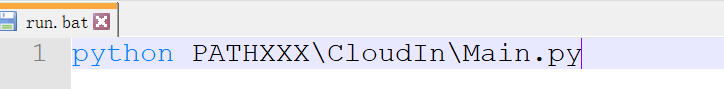
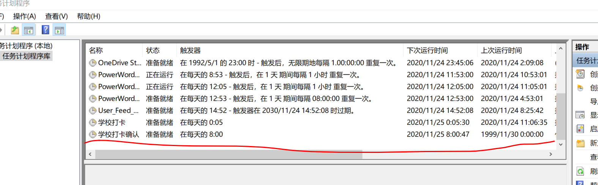
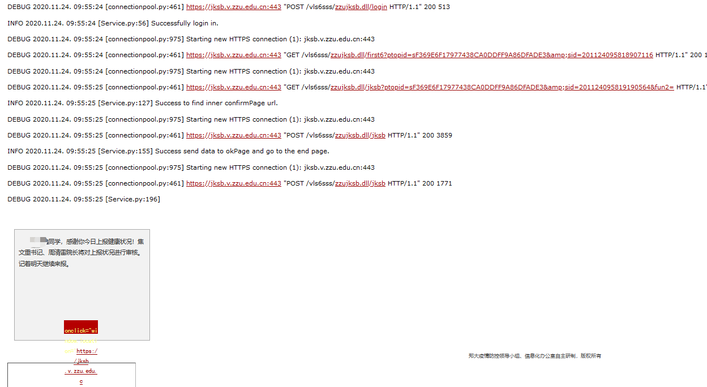

# 郑州大学疫情自动打卡
# 前言

1.为了防止疫情再次扩散，我们一定要如实汇报自己的个人情况，不隐瞒真实状况。

2.但也是为了一定程度减少形式主义，抽出更多的时间去为社会主义建设贡献力量，推荐郑大莘莘学子Star此项目。

# 郑大自动化打卡

设计思路很简单：有首页的地址的话，用Python发带Post数据的Request，一步一步走到打卡成功.

打卡页面一共三个：

- 登录页（传账号密码）
- 信息页（传pid和uid）
- 打卡页（传各种信息，post的信息很多）

交互后，把打卡的成功与否发到自己设置的邮箱中，目前邮箱的发送方是在我，很烦，建议设置成自己，改个邮件码就行。

# 使用方法

1.你首先肯定得把程序荡下来

2.在config,json中配置你的账号、密码、家庭住址（这个还是配上吧，有个页面需要）

3.然后在当前目录执行Python Main.py，Pyhton版本 3.6，不是版本2点多应该都可

4.Python Main.py运行时可能会需要某些包，smtp,requests直接一步一步pip install即可

5.自动打卡是为解放双手，所以在Windows和Linux设置定时任务，前者Bat，后者Shell，前者任务计划程序，后者Contrab。

**设置Windows定时执行程序脚本参照：**

**Windows任务计划程序设置参照 ：  为了确保打卡，共确认两次**

6.打卡成功效果图（发了Log以及打卡成功的Html，效果更佳）：

## 邮箱授权码属私密数据，可以用个人的邮箱去发送，可自行搜索QQ邮箱授权码，在stmp中修改发送邮箱和授权码即可。
## 另外邮箱发送与否，并不影响打卡是否成功。
